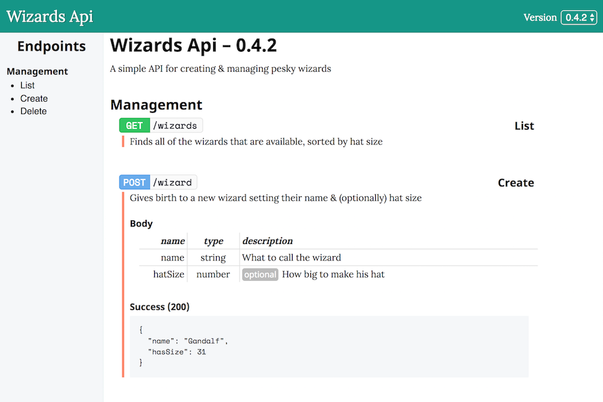

# Ocelot Docs

Generate Api documentation using YAML

```yaml
---
version: 0.4.2
groups:
  - wizards
---

wizards:
  name: Management
  endpoints:
  - get: /wizards list
    info: Finds all of the wizards that are available, sorted by hat size
    
  - post: /wizard create
    info: Gives birth to a new wizard setting their name & (optionally) hat size
    body:
      name: string - What to call the wizard
      hatSize?: number - How big to make his hat
    responses:
    - 200: Success created.json
```

Docs are rendered to index.html in your output directory, which is `docs` by default. If there are compilation errors they are rendered instead into that file.



## Using the CLI

```bash

# Install globally
npm i -g ocelot-docs

# Get help
ocedocs --help

# Install locally for dev
npm i -D ocelot-docs

# Generate documentation
ocedocs --input api --output docs

# Watch the docs (uses an express server)
ocedocs -w

```

## Writing Docs

Docs are written in their own directory, which defaults to `/api`. Ocelot expects this folder to have an `info.yml` which has information about your api. Namely it can have the `name`, `template` and `description` of your api. The `template` is optional and refers to an npm package defining the api template.

### info.yml

```yaml
name: Wizards Api
template: my-custom-npm-template
description: >
  A simple API for creating & managing pesky wizards
```

### Defining Endpoint Versions

After defining that, Ocelot will look for any directories inside your input folder which contain an `endpoints.yml`.

#### endpoints.yml

An endpoints file should contain 2 YAML docs, the first contains version info, details and structure of this version. The second doc contains the endpoint definitions, contained in their groups.

```yaml
---
version: 0.0.1
base: /
groups:
  - wizards
---
wizards:
  base: /wzrd
  name: Wizards
  endpoints:
  - id: index
    method: get
    url: /list
    name: Fetch Wizards
    info: Looks for all wizards and sorts them by hat size
---
```

#### The Version Block

| Field      | Info |
| ---------- | ---- |
| `version`  | The version number |
| `base`     | **optional** – A base url that all endpoints will be added on to |
| `groups`   | The groups of endpoints in this version, a array of strings |

#### The Groups Block

The groups block should be an object containing definitions for each of the groups defined in `version.groups`.

#### Group Definition

| Field       | Info |
| ----------- | ---- |
| `name`      | The name of the group |
| `base`      | **optional** – A base url for this group, relative to the version's base |
| `endpoints` | The list of ***endpoint*** definitions |
<!--  -->
#### Endpoint Definition

| Field       | Info |
| ----------- | ---- |
| `id`        | An identifier for the endpoint |
| `method`    | The method to access the endpoint |
| `url`       | The url to access the endpoint, relative to the group |
| `name`      | The name of the endpoint |
| `info`      | **optional** – A longer description of the endpoint |
| `responses` | **optional** – A list of ***response*** definitions |
| `params`    | **optional** – The url parameters e.g. `/find/:id`, an ***argument*** definition |
| `query`     | **optional** – The query parameters e.g. `?key=val`, an ***argument*** definition |
| `body`      | **optional** – The json body parameters, an ***argument*** definition |

##### Endpoint Shorthand

As seen at the top, you can use the endpoint shorthand which defines the method, url & id in one go. The equivalent of above would be:

``` yaml
endpoints:
  - get: /list index
    name: Fetch Wizards
    info: Looks for all wizards and sorts them by hat size
```

#### Argument Definition

An argument definition is a YAML object with descriptions for a set of arguments. They key is the name of the argument and the value is a string definition containing the type, a dash (`-`) and the description. If the key ends with a `?`, it marks it as optional.

```yaml
name: string - The name of the wizard
age?: number - An optional age of the wizard
```

#### Response Definition

```yaml
- 200: Success index/success.json
- name: Not Found
  status: 404
  body: index/notFound.json
```

A response definition is an array of objects which describes potential responses that the endpoint can return. The first definition is the shorthand and the second is the long form.

* `name` is your name of this response
* `status` is the http status code this response comes with
* `body` is a reference to a file which contains the example body (a json file)

To look for the body it will look look in `data/` inside the version directory, joining the path onto that.


## Custom templates

A template is an npm package used to render an api definition using [pug](https://pugjs.org/). The package should have a `template/` directory which should contain:

* `info.yml` – A file containing info about the template
* `index.pug` – A pug template to render the api definition
* `error.pug` – A pug template to render errors or warnings

### info.yml

```yaml
name: Custom Template
version: 0.1.2
link: https://example.com

assets:
- js
- css
- img
```

| Field     | Info |
| --------- | ---- |
| `name`    | The name of the template |
| `version` | The version of the template |
| `link`    | A link to the template's author |
| `assets`  | **optional** – A list of directories that will be copied into the compiled result |

For more info, see the [default template](https://github.com/robb-j/ocelot-template). There is also the `spec.json`, which is created along side your `index.html`, which is used to render the docs.
